# 🏥 TP2 DevOps - API REST Java EE avec Vagrant

API REST de gestion des Personnes et Patients en Java EE déployée sur **2 VMs Vagrant**.

## 📋 Objectif du TP

Créer une infrastructure complète avec **Vagrant** :
- **srv-app** : Application Java EE (Tomcat 9 + JDK 8/11/17)
- **srv-db** : Base de données MySQL 8
- Déploiement automatisé de l'application web
- Tests API REST

## 🚀 Démarrage Rapide

```bash
# 1. Lancer les VMs
vagrant up

# 2. Se connecter à srv-app
vagrant ssh srv-app

# 3. Déployer l'application
bash /vagrant/scripts/deploy-app-auto.sh
```

**URL de test** : `http://localhost:8888/api_diti4_jee_2025_2-1.0-SNAPSHOT/api/personnes`

## 📸 Captures d'écran du TP

### 1. Configuration Vagrant

#### Vagrantfile
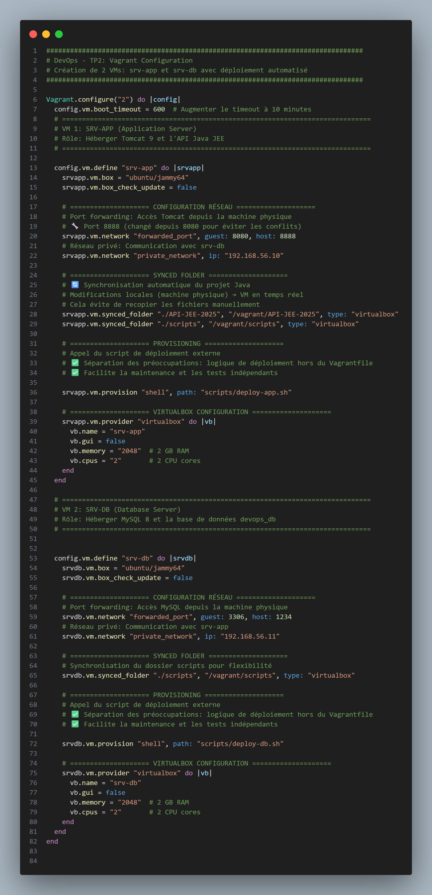

#### Vagrant Up - Création des VMs
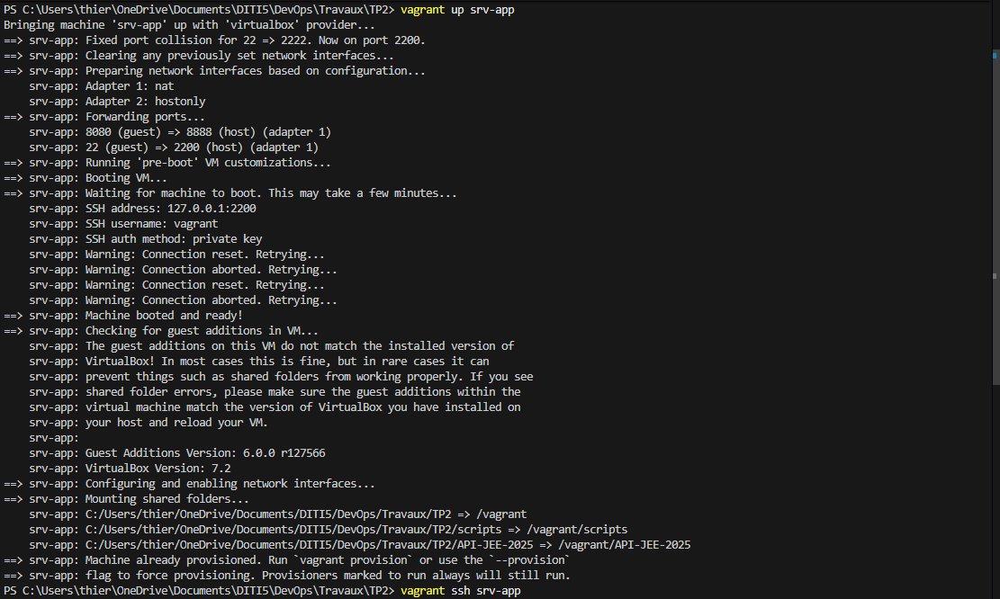

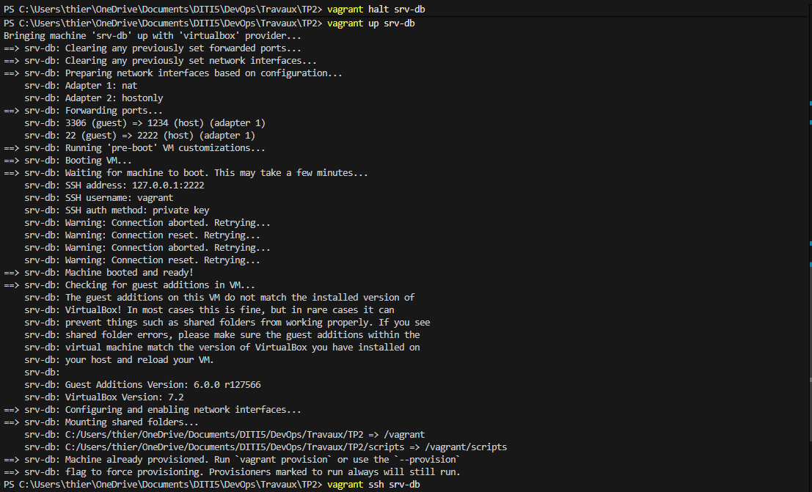

### 2. Scripts de Déploiement

#### deploy-app.sh (srv-app)
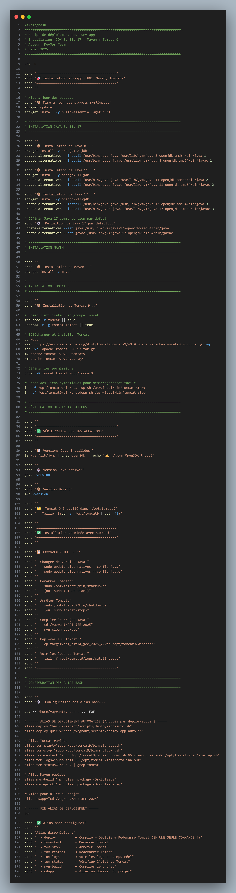

#### deploy-db.sh (srv-db)
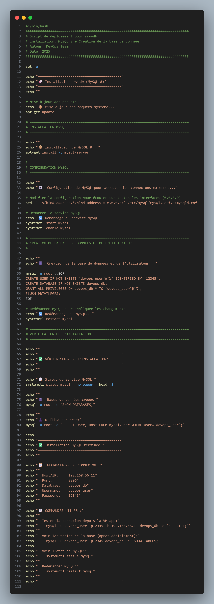

### 3. Connexion SSH aux VMs

#### Connexion à srv-app
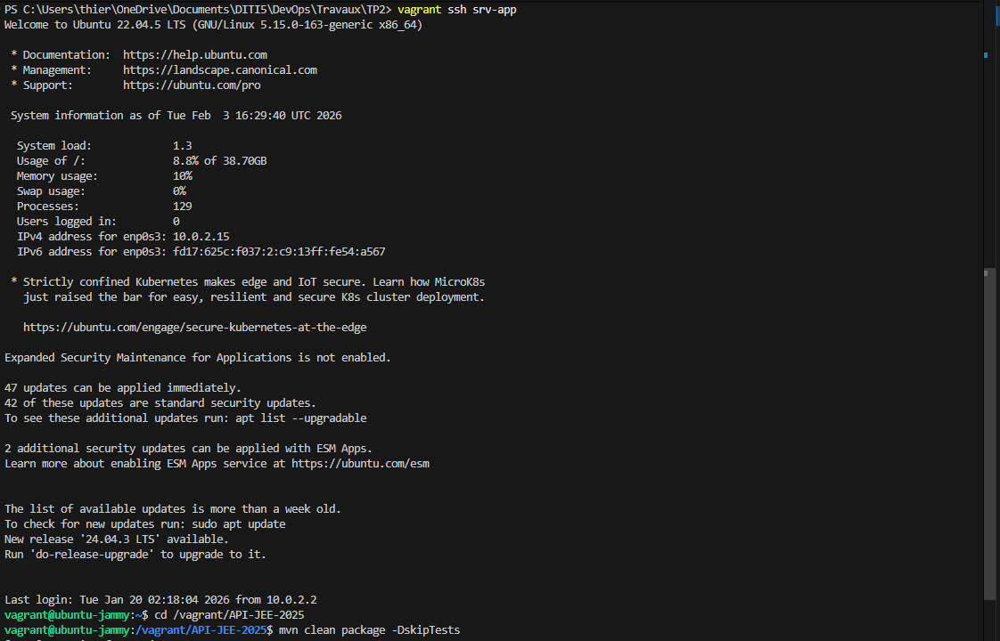

#### Connexion à srv-db
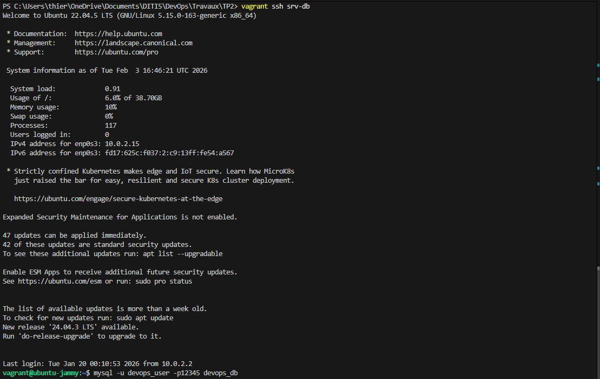

### 4. Base de Données MySQL

#### Connexion à MySQL
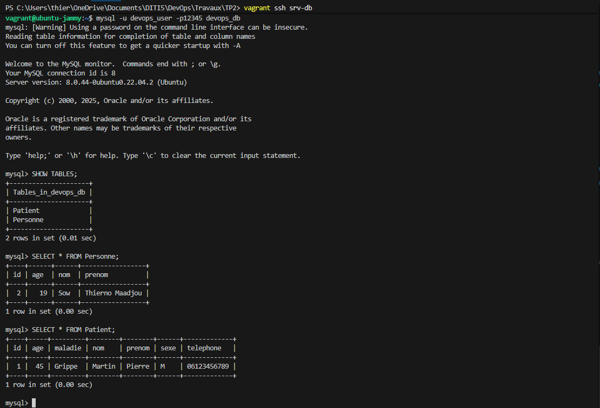

#### Tables créées par Hibernate


#### Vérification des données
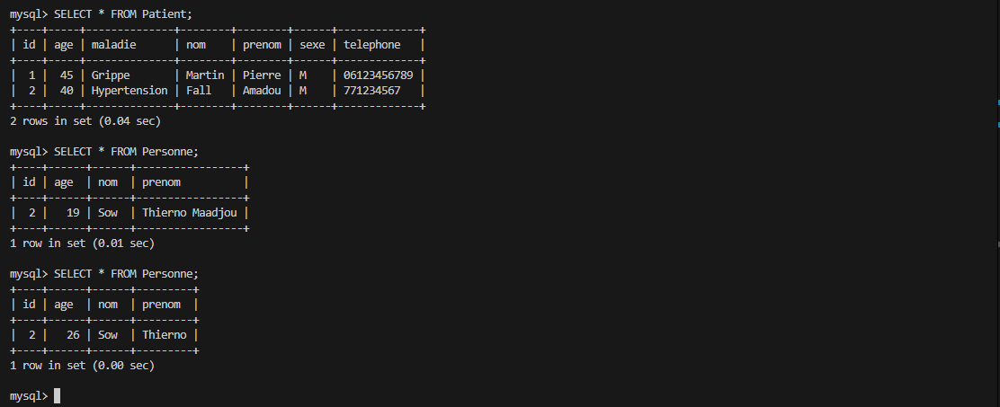

### 5. Tests API avec Postman

#### GET /personnes
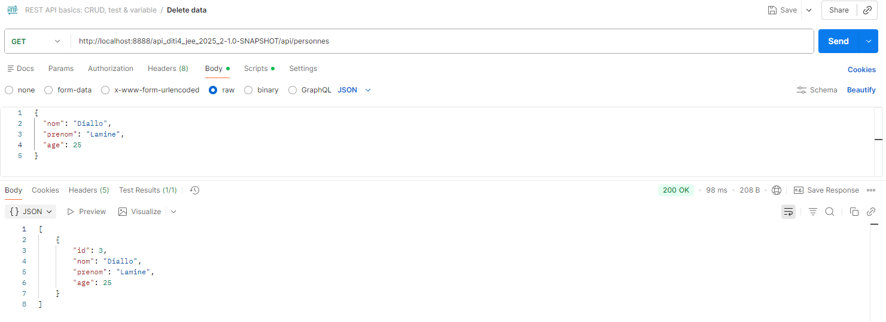

#### POST /personnes
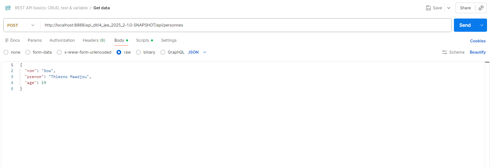

#### GET /patients
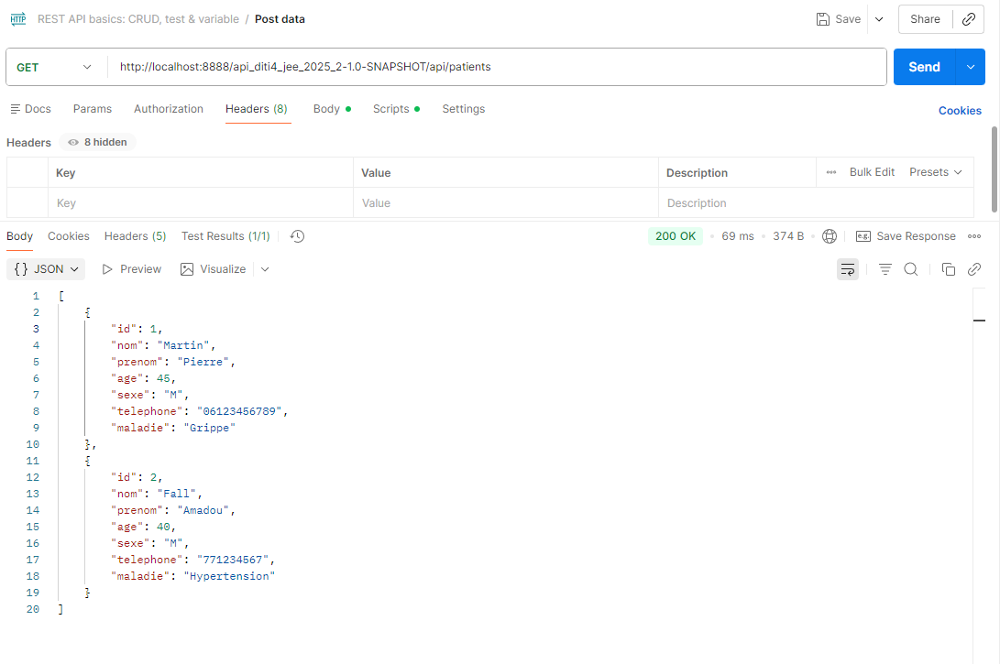

#### POST /patients
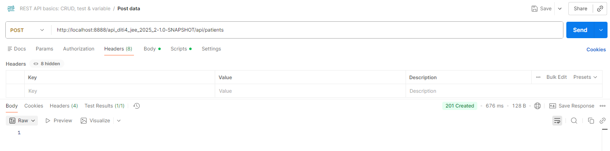

## 🖥️ Infrastructure

### srv-app (192.168.56.10)
- JDK 8, 11, 17
- Maven 3.x
- Tomcat 9.0.93
- Port : 8888→8080

### srv-db (192.168.56.11)
- MySQL 8
- Base : `devops_db`
- User : `devops_user` / `12345`
- Port : 3306→3306

## 🎯 API REST

| Méthode | URL              | Description           |
|---------|------------------|-----------------------|
| GET     | `/personnes`     | Lister les personnes  |
| POST    | `/personnes`     | Créer une personne    |
| PUT     | `/personnes`     | Modifier une personne |
| DELETE  | `/personnes/{id}`| Supprimer une personne|
| GET     | `/patients`      | Lister les patients   |
| POST    | `/patients`      | Créer un patient      |
| PUT     | `/patients`      | Modifier un patient   |
| DELETE  | `/patients/{id}` | Supprimer un patient  |

## 🧪 Exemple de Test

```bash
# Test GET
curl http://localhost:8888/api_diti4_jee_2025_2-1.0-SNAPSHOT/api/personnes

# Test POST
curl -X POST http://localhost:8888/api_diti4_jee_2025_2-1.0-SNAPSHOT/api/personnes \
  -H "Content-Type: application/json" \
  -d '{"nom":"Sow","prenom":"Thierno","age":25}'
```

## 📚 Documentation

Pour plus de détails, voir [COMMANDS.txt](COMMANDS.txt)

## 👨‍💻 Auteur

**Thierno Maadjou Sow**
- Email: thiernomaadjous@gmail.com
- GitHub: [ThiernoMaadjou](https://github.com/ovvoso)

| Catégorie          | Technologie                 | Version            |
|--------------------|-----------------------------|--------------------|
| **Langage**        | Java                        | 17                 |
| **Framework Web**  | JAX-RS (Jersey)             | 2.35               |
| **Persistance**    | JPA / Hibernate             | 5.4.9              |
| **Base de Données**| MySQL                       | 8                  |
| **Serveur App**    | Apache Tomcat               | 9.0.93             |
| **Build**          | Maven                       | 3.x                |
| **Infrastructure** | Vagrant + VirtualBox        | Ubuntu 22.04 Jammy |
| **Utilitaires**    | Lombok, CDI (Weld), JUnit 5 | Dernières versions |

## 🖥️ Infrastructure Vagrant

Deux VMs complètement provisionnées, synchronisées et prêtes à l'emploi :

### **srv-app** (Application Server)
- **IP** : 192.168.56.10
- **Port Forwarding** : `host 8888` → `guest 8080` (Tomcat)
- **Synced Folders** :
  - `./API-JEE-2025` ↔ `/vagrant/API-JEE-2025`
  - `./scripts` ↔ `/vagrant/scripts`
- **Provisioning** : `scripts/deploy-app.sh`
  - ✅ JDK 8, 11, 17 (avec update-alternatives)
  - ✅ Maven 3.x
  - ✅ Tomcat 9.0.93
  - ✅ Alias bash (`deploy`, `tom-*`, `mvn-*`, `cdapp`)

### **srv-db** (Database Server)
- **IP** : 192.168.56.11
- **Port Forwarding** : `host 3306` → `guest 3306` (MySQL)
- **Provisioning** : `scripts/deploy-db.sh`
  - ✅ MySQL 8 Server
  - ✅ Base `devops_db` créée
  - ✅ User `devops_user` avec password `12345`
  - ✅ Binds to `0.0.0.0` pour accès réseau
## 🏗️ Arborescence
```
src/
├── main/
│   ├── java/
│   │   └── sn/isi/diti/
│   │       ├── Model/                  
│   │       │   ├── Personne.java       
│   │       │   └── Patient.java        
│   │       ├── Repository/             
│   │       │   ├── PersonneRepository.java
│   │       │   └── PatientRepository.java
│   │       ├── rest/                    
│   │       │   ├── ApplicationConfig.java
│   │       │   ├── PersonneRest.java
│   │       │   └── PatientRest.java
│   │       └── JPAUtil.java            
│   └── resources/
│       ├── META-INF/
│       │   ├── persistence.xml         
│       │   ├── persistence.xml.template
│       │   └── beans.xml              
│       └── imag/                      
│           ├── api_img_personnes.png
│           ├── api_img_personnes_postman.png
│           ├── api_img_patients.png
│           └── api_img_patients_postman.png
```
## 🎯 Fonctionnalités API

### 👥 Personnes
- **GET** `/personnes` - Récupérer toutes les personnes
- **POST** `/personnes` - Créer une nouvelle personne
- **PUT** `/personnes` - Mettre à jour une personne
- **DELETE** `/personnes/{id}` - Supprimer une personne

### 🏥 Patients
- **GET** `/patients` - Récupérer tous les patients
- **POST** `/patients` - Créer un nouveau patient
- **PUT** `/patients` - Mettre à jour un patient
- **DELETE** `/patients/{id}` - Supprimer un patient

## ⚡ Démarrage Rapide

### Prérequis locaux
- ✅ Vagrant + VirtualBox
- ✅ Git
- ✅ (Optionnel) Postman ou curl

### 🚀 Étapes

```bash
# 1️⃣ Lancer les 2 VMs (provisioning automatique)
vagrant up

# 2️⃣ Se connecter à srv-app
vagrant ssh srv-app

# 3️⃣ Déployer l'application (TOUT EN UNE COMMANDE ! 🎉)
bash /vagrant/scripts/deploy-app-auto.sh

# Ou utiliser l'alias (après source ~/.bashrc)
deploy
```

### ✅ Vérification

```bash
# Depuis Windows PowerShell
curl http://localhost:8888/api_diti4_jee_2025_2-1.0-SNAPSHOT/api/personnes -UseBasicParsing

# Résultat attendu : []
```

### 📮 URL de base

```
http://localhost:8888/api_diti4_jee_2025_2-1.0-SNAPSHOT/api
```
## 🧪 Tests et Exemples

### Avec curl (PowerShell Windows)

```powershell
# GET - Récupérer toutes les personnes
curl http://localhost:8888/api_diti4_jee_2025_2-1.0-SNAPSHOT/api/personnes -UseBasicParsing

# POST - Créer une personne
$body = @{
    nom = "Sow"
    prenom = "Thierno"
    age = 25
} | ConvertTo-Json

Invoke-RestMethod -Method POST `
  -Uri "http://localhost:8888/api_diti4_jee_2025_2-1.0-SNAPSHOT/api/personnes" `
  -ContentType "application/json" `
  -Body $body

# GET - Récupérer tous les patients
curl http://localhost:8888/api_diti4_jee_2025_2-1.0-SNAPSHOT/api/patients -UseBasicParsing

# POST - Créer un patient
$patientBody = @{
    nom = "Fall"
    prenom = "Amadou"
    age = 40
    sexe = "M"
    telephone = "771234567"
    maladie = "Hypertension"
} | ConvertTo-Json

Invoke-RestMethod -Method POST `
  -Uri "http://localhost:8888/api_diti4_jee_2025_2-1.0-SNAPSHOT/api/patients" `
  -ContentType "application/json" `
  -Body $patientBody
```

### Avec Postman

**Base URL** : `http://localhost:8888/api_diti4_jee_2025_2-1.0-SNAPSHOT/api`

#### Test 1 : GET Personnes
```
Method: GET
URL: http://localhost:8888/api_diti4_jee_2025_2-1.0-SNAPSHOT/api/personnes
```

#### Test 2 : POST Personne
```
Method: POST
URL: http://localhost:8888/api_diti4_jee_2025_2-1.0-SNAPSHOT/api/personnes
Headers: Content-Type: application/json
Body:
{
  "nom": "Sow",
  "prenom": "Thierno",
  "age": 25
}
```

#### Test 3 : PUT Personne
```
Method: PUT
URL: http://localhost:8888/api_diti4_jee_2025_2-1.0-SNAPSHOT/api/personnes
Headers: Content-Type: application/json
Body:
{
  "id": 1,
  "nom": "Sow",
  "prenom": "Thierno Maadjou",
  "age": 26
}
```

#### Test 4 : DELETE Personne
```
Method: DELETE
URL: http://localhost:8888/api_diti4_jee_2025_2-1.0-SNAPSHOT/api/personnes/1
```

#### Test 5 : POST Patient
```
Method: POST
URL: http://localhost:8888/api_diti4_jee_2025_2-1.0-SNAPSHOT/api/patients
Headers: Content-Type: application/json
Body:
{
  "nom": "Fall",
  "prenom": "Amadou",
  "age": 40,
  "sexe": "M",
  "telephone": "771234567",
  "maladie": "Hypertension"
}
```
# ⚙️ Alias Bash Disponibles

Une fois dans la VM srv-app, vous pouvez utiliser ces alias pratiques :

| Alias         | Commande                                           | Description                                |
|---------------|----------------------------------------------------|--------------------------------------------|
| `deploy`      | `bash /vagrant/scripts/deploy-app-auto.sh`         | **🚀 Déploiement complet en UNE COMMANDE** |
| `tom-start`   | `sudo /opt/tomcat9/bin/startup.sh`                 | Démarrer Tomcat                            |
| `tom-stop`    | `sudo /opt/tomcat9/bin/shutdown.sh`                | Arrêter Tomcat                             |
| `tom-restart` | `sudo .../shutdown.sh && sleep 3 && .../startup.sh`| Redémarrer Tomcat                          |
| `tom-logs`    | `sudo tail -f /opt/tomcat9/logs/catalina.out`      | Voir les logs en temps réel                |
| `tom-status`  | `ps aux \| grep tomcat`                            | Vérifier l'état de Tomcat                  |
| `mvn-build`   | `mvn clean package -DskipTests`                    | Compiler le projet                         |
| `mvn-quick`   | `mvn clean package -DskipTests -q`                 | Compiler en mode silencieux                |
| `cdapp`       | `cd /vagrant/API-JEE-2025`                         | Aller au dossier du projet                 |

### Utilisation

```bash
# Charger les alias
source ~/.bashrc

# Déployer l'application
deploy

# Vérifier l'état de Tomcat
tom-status

# Voir les logs
tom-logs

# Aller au projet
cdapp
```

## 🏭 Architecture Technique

### **Persistance / Base de Données**

| Propriété          | Valeur                                                         |
|--------------------|----------------------------------------------------------------|
| Fichier config     | `src/main/resources/META-INF/persistence.xml`                  |
| Driver             | `com.mysql.cj.jdbc.Driver`                                     |
| URL                | `jdbc:mysql://192.168.56.11:3306/devops_db?serverTimezone=UTC` |
| Username           | `devops_user`                                                  |
| Password           | `12345`                                                        |
| Dialecte Hibernate | `org.hibernate.dialect.MySQL8Dialect`                          |

### **Modèle de Données**

#### Personne
```java
@Entity
public class Personne {
    @Id
    @GeneratedValue
    private int id;
    private String nom;
    private String prenom;
    private int age;
}
```

#### Patient (hérite de Personne)
```java
@Entity
public class Patient extends Personne {
    private String sexe;
    private String telephone;
    private String maladie;
}
```

### **Architecture en Couches**

```
┌─────────────────────────────────────────────┐
│           JAX-RS REST API                   │
│  (PersonneRest.java, PatientRest.java)      │
├─────────────────────────────────────────────┤
│        Repository Layer                     │
│ (PersonneRepository, PatientRepository)     │
├─────────────────────────────────────────────┤
│     JPA / Hibernate ORM                     │
├─────────────────────────────────────────────┤
│       MySQL Database                        │
│  (srv-db @ 192.168.56.11:3306)              │
└─────────────────────────────────────────────┘
```
## 📚 Documentation Complète

Pour toutes les commandes détaillées, consultez [COMMANDS.txt](COMMANDS.txt) qui contient :
- Commandes testées et vérifiées
- Exemples d'utilisation complets
- Workflow récapitulatif

## 👨‍💻 Auteur

**[Thierno Maadjou Sow]** - Développeur Full-Stack
- GitHub: [@ovvoso](https://github.com/ovvoso)
<!-- - LinkedIn: [Votre Profil](https://linkedin.com/in/votre-profil) -->
- Email: thiernomaadjous@gmail.com
<div align="center">

🎉 **Merci d'avoir utilisé ce système de gestion des tutoriels DevOps !**
**⭐ Si ce projet vous aide, n'hésitez pas à lui donner une étoile sur GitHub ! ⭐**

*Fait avec ❤️ et beaucoup de ☕*

</div>